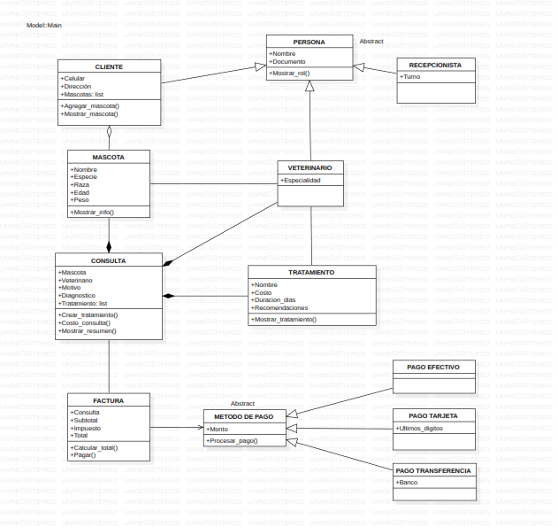

# Sistema de Gestión - Hospital Veterinario

Sistema de gestión por consola para un hospital veterinario, desarrollado en Python con principios de Programación Orientada a Objetos (POO). Permite administrar veterinarios, clientes, mascotas, consultas, tratamientos y facturación con múltiples métodos de pago.

**Autores:** Norman Raúl Aya, Laura Camila Parra  
**Fecha:** 15 de abril de 2026  
---

## Tabla de contenido

- [Características](#características)
- [Diagrama UML](#diagrama-UML)
- [Menú principal](#menú-principal)
- [Flujo de uso recomendado](#flujo-de-uso-recomendado)
- [Conceptos de POO aplicados](#conceptos-de-poo-aplicados)

---

## Características

- Registro y consulta de **veterinarios** con especialidad
- Registro y consulta de **clientes** con datos de contacto
- Gestión de **mascotas** vinculadas a sus dueños (especie, raza, edad, peso)
- Registro de **consultas** con diagnóstico y múltiples tratamientos
- Generación de **facturas** con cálculo automático de IVA (19%)
- Tres **métodos de pago**: efectivo, tarjeta de crédito/débito y transferencia bancaria
---

## Diagrama UML

```


```


---

## Menú principal

```
=====================================================================
            SISTEMA DE GESTIÓN - HOSPITAL VETERINARIO
=====================================================================
  1. Registrar veterinario
  2. Ver veterinarios
  3. Registrar cliente
  4. Ver clientes
  5. Agregar mascota a un cliente
  6. Ver mascotas de un cliente
  7. Registrar consulta (con tratamientos)
  8. Ver consultas
  9. Generar factura y pagar
  0. Salir
=====================================================================
```

---

## Flujo de uso recomendado

Para un uso correcto del sistema, se recomienda seguir este orden:

```
1. Registrar al menos un veterinario        → Opción 1
2. Registrar al menos un cliente            → Opción 3
3️. Agregar una mascota al cliente           → Opción 5
4️. Registrar una consulta con tratamiento   → Opción 7
5️. Generar factura y procesar el pago       → Opción 9
```

> ⚠️ El sistema valida las dependencias: no se puede registrar una consulta sin clientes, veterinarios y mascotas previos.

---

## Conceptos de POO aplicados

| Concepto | Implementación |
|---|---|
| **Abstracción** | Clases abstractas `Persona` y `MetodoPago` con método `@abstractmethod` |
| **Herencia** | `Recepcionista`, `Veterinario` y `Cliente` heredan de `Persona`; los métodos de pago heredan de `MetodoPago` |
| **Polimorfismo** | `mostrar_rol()` se comporta distinto en cada subclase de `Persona`; `procesar_pago()` varía según el método de pago |
| **Agregación** | `Cliente` agrupa una lista de `Mascota`; `Consulta` agrupa una lista de `Tratamiento`. Las mascotas y tratamientos pueden existir conceptualmente de forma independiente al cliente o consulta |
| **Asociación** | `Consulta` se asocia con `Veterinario` y `Mascota` para registrar la atención; `Factura` se asocia con una `Consulta` para calcular el cobro |
| **Composición** | `Consulta` contiene objetos `Mascota`, `Veterinario` y `Tratamiento`; `Factura` contiene una `Consulta` |

---

## Notas:

- El IVA aplicado en la facturación es del **19%**, definido como constante de clase en `Factura.IMPUESTO`.
- Los pagos con tarjeta solicitan los **últimos 4 dígitos** para confirmar el instrumento de pago.
- Los pagos por transferencia solicitan el **nombre del banco** emisor.


- Los pagos por transferencia solicitan el **nombre del banco** emisor.

